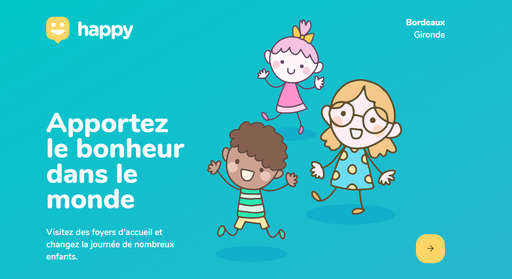
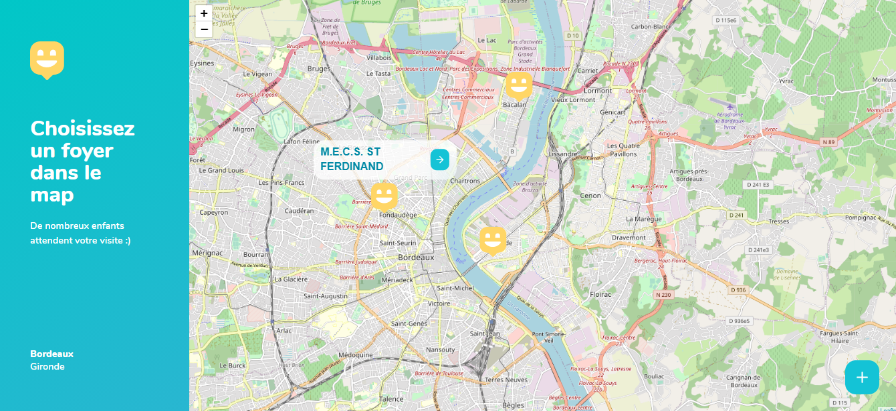
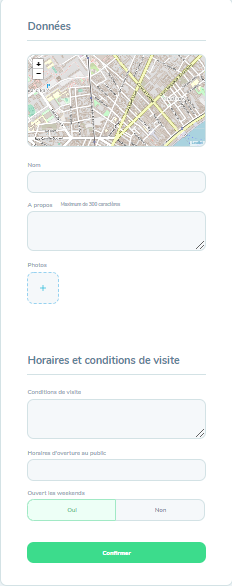
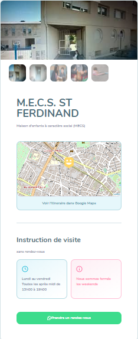

<h1 align="center">
    
</h1>

  <a href="#-technologies">Technologies</a>&nbsp;&nbsp;&nbsp;|&nbsp;&nbsp;&nbsp;
  <a href="#-projet">Projet</a>&nbsp;&nbsp;&nbsp;|&nbsp;&nbsp;&nbsp;
  <a href="#-layout">Layout</a>&nbsp;&nbsp;&nbsp;|&nbsp;&nbsp;&nbsp;

 

  

 

  

## 🚀 Technologies

Ce projet a été développé avec les technologies suivantes:

- [Node.js](https://nodejs.org/en/)
- [React](https://reactjs.org)
- [React Native](https://facebook.github.io/react-native/)
- [Expo](https://expo.io/)
- [TypeScript](https://www.typescriptlang.org/)

## 💻 Projet

Le Happy est une application qui lie les gens aux défavorisés pour rendre la journée de nombreux enfants et adolescents plus heureuse.💜

## 🔖 Layout

Ci-dessous, vous trouverez la mise en page du projet Web et mobile. 

- Layout Web

 

 

 

- Layout Mobile
en développment 

---

Projet développé au cours de la semaine NLW3 promu par Rocketseat, Brésil.
